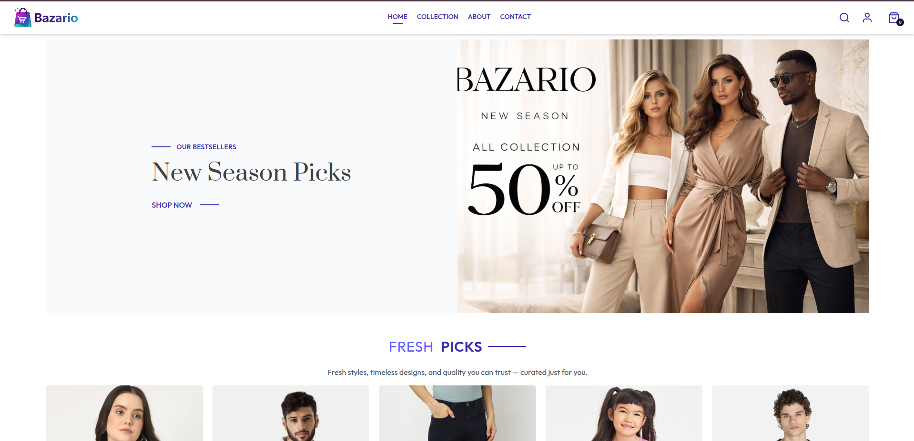

# 🛒 Bazario – Full-Stack E-commerce Application

---



<!-- You can paste an image directly below this comment -->

---

## 👨‍💻 About Me

**Md Sahbaz Alam**  
Full-Stack Developer | MERN Stack Specialist

📧 Email: amdsahbaz19@gmail.com  
💼 LinkedIn: [linkedin.com/in/sahbaz-alam-a95680262](https://www.linkedin.com/in/sahbaz-alam-a95680262/)  
🐙 GitHub: [github.com/mdsahbazkhan](https://github.com/mdsahbazkhan)  
🌐 Live Project: [bazario-frontend-one.vercel.app](https://bazario-frontend-one.vercel.app/)

---

## 📋 Project Overview

Bazario is a production-ready **full-stack MERN e-commerce platform** that I built from scratch. It includes a complete shopping experience for customers and a powerful admin dashboard for managing products, orders, and analytics. The project demonstrates my ability to architect and deploy a complex, real-world application with modern technologies.

### What I Built

- A responsive e-commerce storefront with product browsing, cart management, and checkout
- A secure authentication system using JWT and Google OAuth
- An admin panel with role-based access for product and order management
- Payment integration with Stripe and Razorpay
- Cloud-based image storage with Cloudinary
- Real-time analytics dashboard for revenue and order tracking

---

## 🛠 Tech Stack

| Category | Technologies |
|----------|--------------|
| **Frontend** | React.js, Vite, Tailwind CSS, React Router |
| **Backend** | Node.js, Express.js |
| **Database** | MongoDB, Mongoose |
| **Authentication** | JWT, Google OAuth |
| **Payments** | Stripe, Razorpay |
| **Storage** | Cloudinary |
| **Deployment** | Vercel |

---

## 💻 Key Features

### 👤 Customer Features
- User Registration & Login (JWT)
- Google OAuth Integration
- Product Browsing, Search & Filtering
- Shopping Cart & Quantity Management
- Order Placement & Order History
- Secure Checkout with Stripe/Razorpay
- Fully Responsive Design

### 👨‍💼 Admin Features
- Role-based Admin Authentication
- CRUD Operations for Products
- Order Management & Tracking
- Admin Dashboard with Analytics
  - Revenue Insights
  - Order Statistics
  - Product Management
- Customer Message Management

---

## 🚀 Live Demo

| Platform | URL |
|----------|-----|
| **User App** | https://bazario-frontend-one.vercel.app/ |
| **Admin Panel** | https://bazario-admin-seven.vercel.app/dashboard |
| **GitHub** | https://github.com/mdsahbazkhan/ecommerce-web |

---

## 📸 Project Screenshots

<!-- Add your screenshots below -->

### 🏠 Home Page
<!-- PASTE HOME PAGE SCREENSHOT HERE -->

---

### 🛒 Shopping Cart
<!-- PASTE CART SCREENSHOT HERE -->

---

### 👨‍💼 Admin Dashboard
<!-- PASTE ADMIN DASHBOARD SCREENSHOT HERE -->

---

### 📱 Mobile Responsive View
<!-- PASTE MOBILE SCREENSHOT HERE -->

---

## 📁 Project Structure

```
ecommerce-web/
│
├── backend/               # Express.js REST API
│   ├── config/           # Database & Cloudinary config
│   ├── controllers/      # Business logic
│   ├── middleware/       # Auth & file upload middleware
│   ├── models/           # Mongoose schemas
│   ├── routes/           # API endpoints
│   └── index.js          # Server entry point
│
├── admin/                 # React Admin Panel
│   ├── src/
│   │   ├── components/   # Reusable UI components
│   │   └── pages/        # Dashboard, Orders, Products, etc.
│   └── public/
│
└── frontend/              # React E-commerce Store
    ├── src/
    │   ├── components/   # UI components
    │   ├── pages/        # Home, Shop, Cart, Login, etc.
    │   ├── context/      # React Context for state
    │   └── assets/       # Images & icons
    └── public/
```

---

## ⚙️ Environment Variables

Create a `.env` file in the `backend` folder:

```env
PORT=8000
MONGODB_URI=your_mongodb_connection_string
JWT_SECRET=your_jwt_secret

CLOUDINARY_NAME=your_cloud_name
CLOUDINARY_API_KEY=your_api_key
CLOUDINARY_SECRET_KEY=your_secret_key

GOOGLE_CLIENT_ID=your_google_client_id

STRIPE_SECRET_KEY=your_stripe_key
RAZORPAY_KEY_ID=your_key
RAZORPAY_SECRET=your_secret
```

---

## 🏃‍♂️ Run Locally

### Backend Setup
```bash
cd backend
npm install
npm run server
```

### Frontend Setup
```bash
cd frontend
npm install
npm run dev
```

- Frontend: http://localhost:5173
- Backend: http://localhost:8000

---

## 🏆 Key Achievements

- ✅ Built a complete full-stack e-commerce application
- ✅ Implemented secure authentication with JWT & OAuth
- ✅ Integrated multiple payment gateways (Stripe & Razorpay)
- ✅ Created an analytics-powered admin dashboard
- ✅ Deployed to production on Vercel
- ✅ Clean, modular, and scalable codebase

---

## 📬 Contact

Feel free to reach out for collaboration or any questions!

**Email:** amdsahbaz19@gmail.com  
**LinkedIn:** https://www.linkedin.com/in/sahbaz-alam-a95680262/  
**GitHub:** https://github.com/mdsahbazkhan

---

<p align="center">
  <strong>⭐ Star this project if you found it helpful!</strong>
</p>
